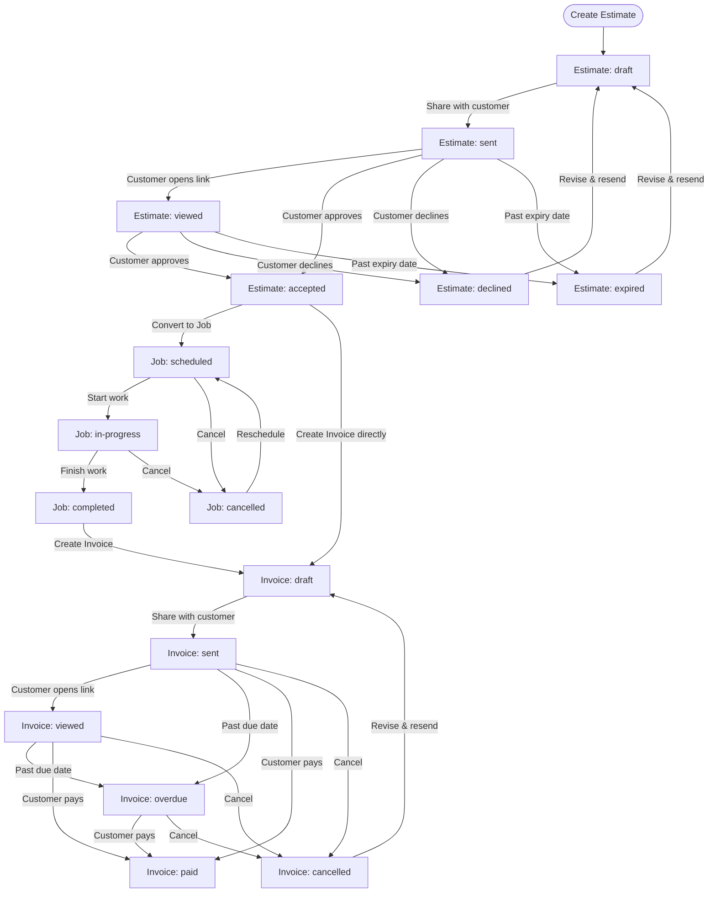
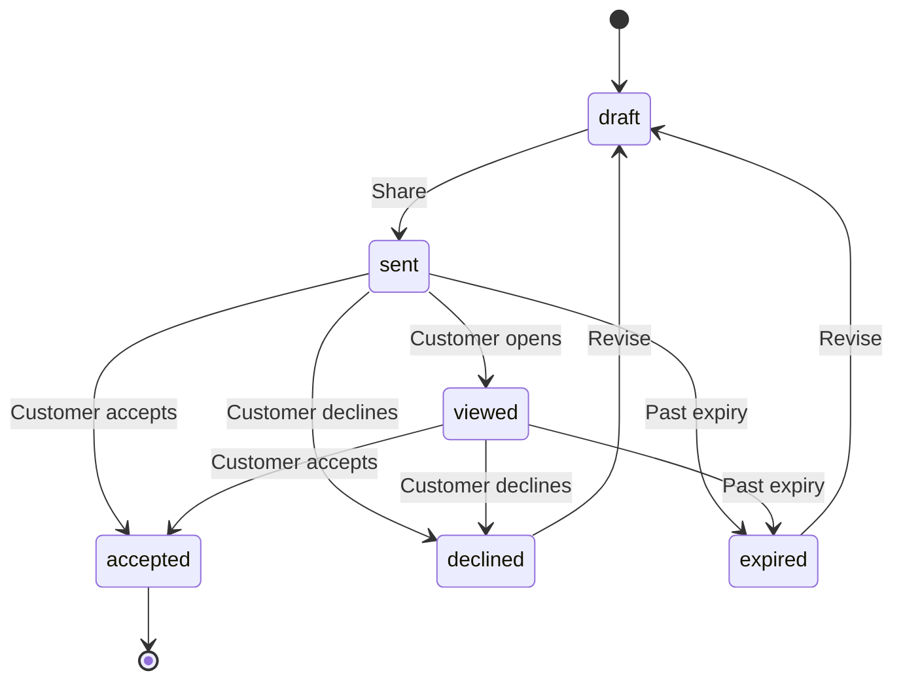
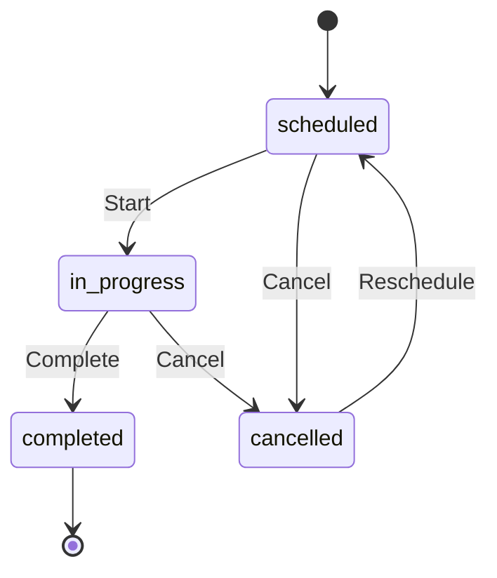
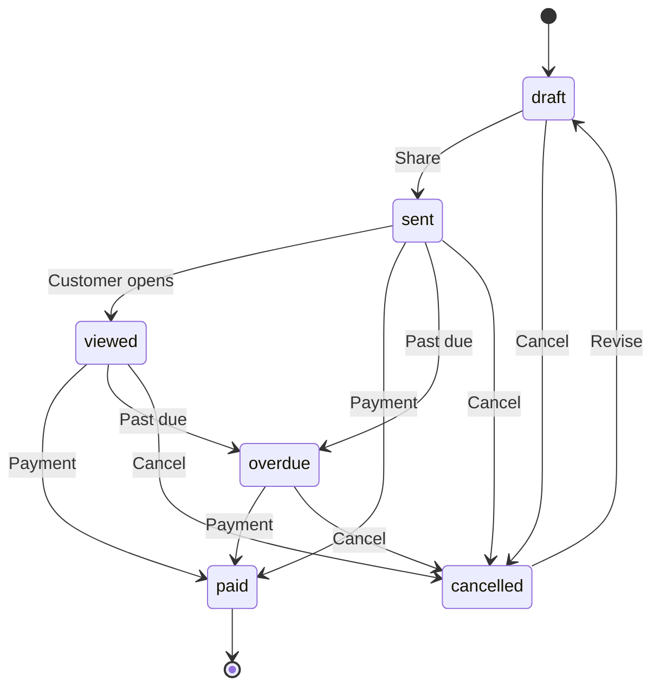

# Estimate → Job → Invoice Workflow Guide

This guide walks through the complete lifecycle of work in JobRun — from
quoting a customer to collecting payment.

## Overview

JobRun supports three core entities that link together:

| Entity     | Purpose                              | Starting Status |
|------------|--------------------------------------|-----------------|
| **Estimate** | Quote a price for prospective work | `draft`         |
| **Job**      | Schedule and track the work itself | `scheduled`     |
| **Invoice**  | Bill the customer and collect payment | `draft`      |

You can use all three together or mix and match depending on the situation:

- **Full workflow** — Estimate → Job → Invoice
- **Skip the estimate** — Job → Invoice (for repeat customers or fixed-price work)
- **Skip the job** — Estimate → Invoice (for simple sales with no fieldwork)

---

## Flow Diagram



---

## Step-by-Step Walkthrough

### 1. Creating an Estimate

An estimate lets you quote a price before committing to work.

1. Tap **New Estimate** and select a customer.
2. Add **line items** — pick from your price book or enter custom items.
   Each line item has a name, quantity, and unit price.
3. Set a **tax rate** if applicable (defaults to 0 %).
4. Set an **expiration date** (defaults to 30 days from today).
5. Add optional **notes** (terms, scope description, etc.).
6. Save — the estimate starts in **draft** status.

**What gets calculated automatically:**

```
subtotal  = Σ (quantity × unit price)
tax       = subtotal × (tax rate ÷ 100)
total     = subtotal + tax
```

### 2. Sharing an Estimate

Once you're happy with the draft:

1. Tap **Share** on the estimate detail screen.
2. Choose how to send it — message, email, or copy the link.
3. The status automatically changes from `draft` → `sent`.

The share link is self-contained (all data is encoded in the URL), so the
customer can view it without needing an account.

### 3. Customer Response

After sharing, three outcomes are possible:

| Outcome      | Status change     | What to do next                 |
|--------------|-------------------|---------------------------------|
| **Accepted** | `sent` → `accepted` | Convert to a job or create an invoice |
| **Declined** | `sent` → `declined` | Revise and resend (returns to `draft`) |
| **Expired**  | `sent` → `expired`  | Revise and resend (returns to `draft`) |

### 4. Converting an Estimate to a Job

When an estimate is **accepted** and fieldwork is needed:

1. Open the accepted estimate.
2. Tap **Convert to Job**.
3. A new job is created with:
   - The same customer and line items
   - Today's date as the scheduled date (editable)
   - Title set to "Job from Estimate"
   - Status set to `scheduled`
4. The estimate and job are linked in both directions — you can navigate
   between them at any time.

> **Note:** You can only convert an estimate that has been accepted and has
> not already been converted. The Convert button won't appear otherwise.

### 5. Working the Job

Move the job through its lifecycle:

| Action         | Status change                  |
|----------------|--------------------------------|
| **Start Job**  | `scheduled` → `in-progress`   |
| **Complete**   | `in-progress` → `completed`   |
| **Cancel**     | `scheduled` or `in-progress` → `cancelled` |
| **Reschedule** | `cancelled` → `scheduled`     |

While a job is in progress you can:

- Update the description and notes
- Add before/after **photos**
- Adjust the scheduled date and time
- Modify line items if the scope changes

### 6. Generating an Invoice

Create an invoice from a **completed job** or an **accepted estimate**:

**From a completed job:**

1. Open the job and tap **Create Invoice**.
2. Line items and totals carry over from the job.
3. Tax rate defaults to 0 % (adjust as needed).
4. Payment terms default to "Due upon receipt".
5. Due date defaults to 30 days out.

**From an accepted estimate (no job needed):**

1. Open the accepted estimate and tap **Create Invoice**.
2. Line items, tax rate, and totals carry over from the estimate.
3. Payment terms default to "Due upon receipt".

Either way the invoice starts in **draft** status. Review the details, then
share it with the customer.

**Invoice numbers** are auto-generated in sequence: `INV-0001`, `INV-0002`,
etc.

### 7. Sharing an Invoice

1. Tap **Share** on the invoice detail screen.
2. The status automatically changes from `draft` → `sent`.
3. The customer receives a self-contained link showing the invoice details,
   amount due, and payment terms.

### 8. Collecting Payment

When the customer pays:

1. Open the invoice and tap **Mark as Paid**.
2. The status changes to `paid` and a timestamp is recorded.

Supported payment methods:

| Method   | Description                      |
|----------|----------------------------------|
| `stripe` | Online payment via Stripe        |
| `cash`   | Cash payment                     |
| `check`  | Check payment                    |
| `other`  | Any other payment method         |

If an invoice passes its due date without payment, it transitions to
**overdue**. An overdue invoice can still be marked as paid or cancelled.

---

## Status Transition Reference

### Estimate Statuses



| From       | Allowed transitions              |
|------------|----------------------------------|
| `draft`    | `sent`                           |
| `sent`     | `accepted`, `declined`, `expired`|
| `viewed`   | `accepted`, `declined`, `expired`|
| `accepted` | _(terminal)_                     |
| `declined` | `draft`                          |
| `expired`  | `draft`                          |

### Job Statuses



| From          | Allowed transitions              |
|---------------|----------------------------------|
| `scheduled`   | `in-progress`, `cancelled`       |
| `in-progress` | `completed`, `cancelled`         |
| `completed`   | _(terminal)_                     |
| `cancelled`   | `scheduled`                      |

### Invoice Statuses



| From        | Allowed transitions                     |
|-------------|-----------------------------------------|
| `draft`     | `sent`, `cancelled`                     |
| `sent`      | `viewed`, `paid`, `overdue`, `cancelled`|
| `viewed`    | `paid`, `overdue`, `cancelled`          |
| `paid`      | _(terminal)_                            |
| `overdue`   | `paid`, `cancelled`                     |
| `cancelled` | `draft`                                 |

---

## Entity Relationships

```
Customer
 ├── Estimate
 │     ├── → Job     (estimate.jobId)
 │     └── → Invoice (invoice.estimateId)
 │
 ├── Job
 │     ├── → Estimate (job.estimateId)
 │     └── → Invoice  (job.invoiceId)
 │
 └── Invoice
       ├── → Job      (invoice.jobId)
       ├── → Estimate (invoice.estimateId)
       └── Payments[]
```

All three entities share a common **line item** structure:

| Field        | Description                |
|--------------|----------------------------|
| `name`       | Service or item name       |
| `description`| Optional detail            |
| `quantity`   | Number of units            |
| `unitPrice`  | Price per unit             |
| `total`      | quantity × unitPrice       |
| `serviceId`  | Optional price book reference |

When you convert between entities, line items are copied so each entity
maintains its own independent record.

---

## Practical Tips

- **Price book first.** Populate your price book with common services so
  adding line items to estimates and jobs is fast and consistent.

- **Draft before sharing.** Use `draft` status to review everything before
  the customer sees it. Sharing automatically marks the document as `sent`.

- **Set realistic expiration dates.** The default 30-day expiry works for
  most situations, but shorten it for time-sensitive work to encourage
  faster decisions.

- **Add photos to jobs.** Before-and-after photos attached to a job create a
  record of the work performed — useful for disputes and future reference.

- **Use the direct paths when they fit.** Not every job needs an estimate,
  and not every estimate needs a job. Use the full workflow for new
  customers and big projects; skip steps for repeat work.

- **Track overdue invoices.** Invoices past their due date move to `overdue`
  automatically. Check the invoice list filtered by status to follow up
  promptly.

- **Cancelled is not deleted.** Cancelling an estimate, job, or invoice
  preserves the record and lets you revert to `draft` or `scheduled` if
  plans change.
